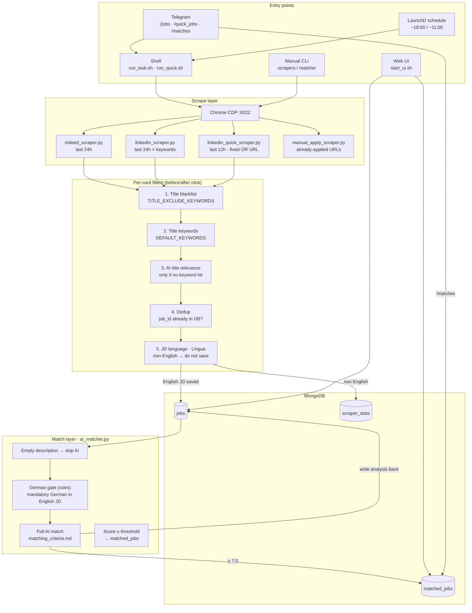
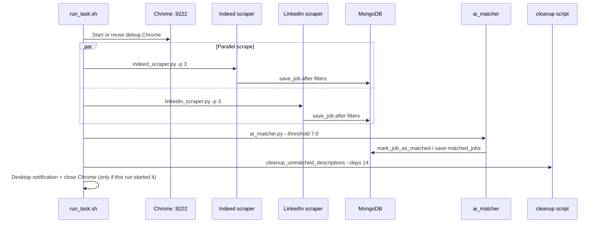
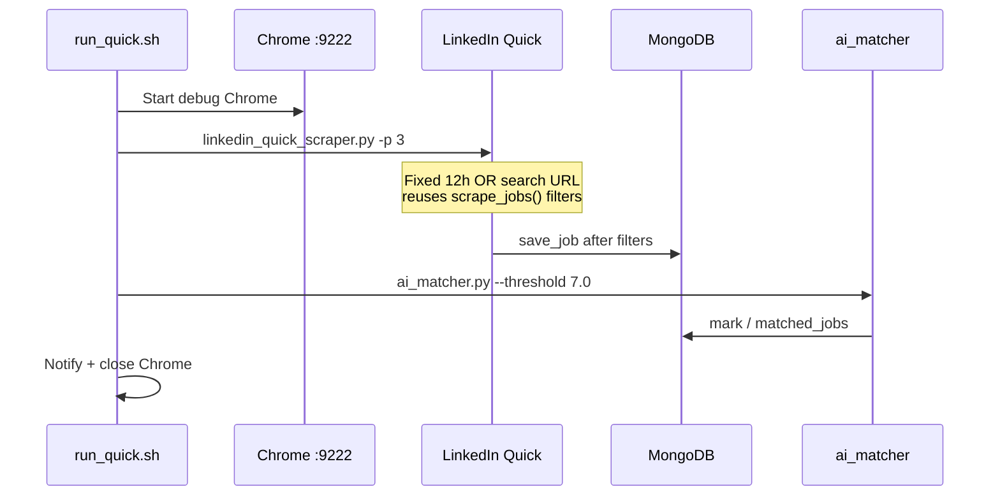
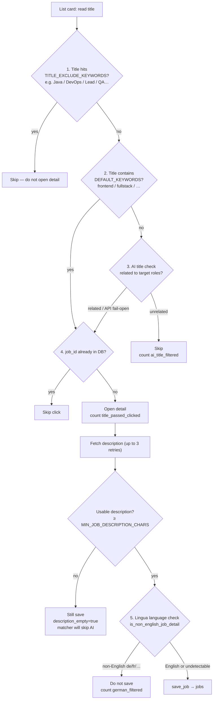
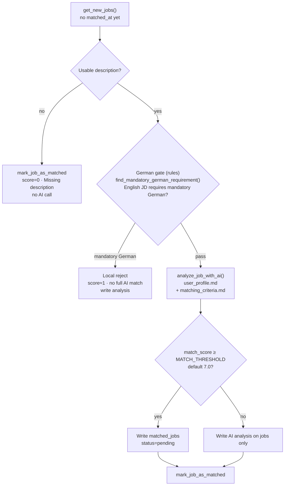

# Job Scraper — Architecture & Flows

This document describes the current architecture, entry commands, and the full chain: scrape → filter → AI match.

All project docs and code comments are written in English.

---

## 1. System overview



---

## 2. Commands / entry points

### 2.1 Daily pipelines

| Command | When | What it does | Typical time |
|---------|------|--------------|--------------|
| `./run_task.sh` | ~18:00 (or Telegram `/jobs`) | Indeed + LinkedIn in parallel (24h) → AI match → cleanup old unmatched descriptions | 40–60 min |
| `./run_quick.sh` | ~11:00 (or Telegram `/quick_jobs`) | LinkedIn Quick only (12h) → AI match | 10–20 min |
| `./start_ui.sh` | Anytime | Start Job Tracker Web UI (default `:5050`) | — |

Prefer `caffeinate -i` for manual runs so sleep does not interrupt Playwright:

```bash
caffeinate -i ./run_task.sh
caffeinate -i ./run_quick.sh
```

### 2.2 Telegram bot commands

| Command | Purpose |
|---------|---------|
| `/start` | Confirm bot is online |
| `/test` | Confirm the Mac is connected and ready |
| `/jobs` | Run `run_task.sh` in the background; push today’s match cards when done |
| `/quick_jobs` | Run `run_quick.sh` in the background |
| `/matches` | Push today’s `matched_jobs` without scraping |

Start the bot: `python3 src/bot/telegram_bot.py`

### 2.3 Standalone CLI (debug / partial runs)

| Command | Purpose |
|---------|---------|
| `python3 src/scrapers/indeed_scraper.py [-k …] [-p N]` | Indeed only |
| `python3 src/scrapers/linkedin_scraper.py [-k …] [-p N]` | Full LinkedIn (keyword loop) |
| `python3 src/scrapers/linkedin_quick_scraper.py [-p N] [-j N]` | LinkedIn 12h Quick |
| `python3 src/matching/ai_matcher.py [-l N] [-s source] [-t 7.0]` | AI match only (jobs without `matched_at`) |
| `python3 src/scrapers/manual_apply_scraper.py <urls…>` | Already-applied jobs → scrape + score → `matched_jobs` with `status=applied` |
| `python3 scripts/cleanup_unmatched_descriptions.py …` | Clear old unmatched JD text (also run at end of full pipeline) |
| `python3 scripts/cleanup_excluded_titles.py …` | Cleanup DB rows by title blacklist |
| `python3 scripts/eval_matcher.py …` | Matcher evaluation |

---

## 3. Full vs Quick pipelines

### 3.1 Full — `run_task.sh` / `/jobs`



Order:

1. Chrome remote debugging (reuse if `:9222` already open)
2. **Indeed + LinkedIn in parallel** (up to 3 pages × keywords)
3. After both finish → **AI matcher**
4. Clear descriptions on unmatched jobs older than 14 days
5. Notify + optionally close Chrome

### 3.2 Quick — `run_quick.sh` / `/quick_jobs`



Differences from Full:

- **LinkedIn only** (no Indeed)
- No keyword loop — one pre-built OR search URL (Full Stack / Frontend / Product / GenAI, `f_TPR=r43200` = 12h)
- **No** description cleanup step
- Card processing reuses `linkedin_scraper.scrape_jobs()` (same title + language filters)

---

## 4. Per-job funnel: list card → database

For every list card during scrape:



### What each stage does

| Step | Implementation | Purpose |
|------|----------------|---------|
| 1. Title blacklist | `is_title_excluded()` · `TITLE_EXCLUDE_KEYWORDS` | Skip clearly wrong roles before clicking |
| 2. Keyword hit | `title_matches_default_keywords()` · `DEFAULT_KEYWORDS` | Title already on-target → click without AI |
| 3. AI title screen | `is_title_relevant_by_ai()` | After blacklist + no keyword: cheap AI “is this a target role?” |
| 4. Dedup | `is_job_id_exists()` | Do not re-open known jobs |
| 5. JD language | `is_non_english_job_detail()` · Lingua | **JD body not English** (usually German posts) → **do not save**. UI: German Filtered |

> Step 5 answers “what language is the JD written in?”, not “does an English JD require German skills?”. The latter is the match-stage German gate.

Unified title-gate entry point:

`should_skip_title_before_click()` → `src/core/scraper_utils.py`

---

## 5. After save: pre-AI and AI matching

`ai_matcher.py` only processes `jobs` documents that still lack `matched_at`:



### Do not confuse the two German-related gates

| | Scrape · language detection | Match · German gate |
|--|-----------------------------|---------------------|
| **Module** | `scraper_utils.is_non_english_job_detail` | `matching/german_gate.py` |
| **Question** | What language is the JD **written in**? (Lingua) | Does an **English** JD require German as a must-have skill? |
| **Typical hit** | Entire German posting | “German fluent required”, “C1 Deutsch”, “must speak German” |
| **Does not hit** | — | “Berlin, Germany” alone, German company, German as nice-to-have |
| **Outcome** | **Not saved**; count `german_filtered` | **Saved then rejected**; low score; **no full AI scoring** |
| **Order** | Earlier (on detail fetch) | Later (matcher entry) |

The AI prompt / `matching_criteria.md` also describes a German gate as a fallback. In code, the rule-based `german_gate` runs first and skips the model when it hits.

### AI scoring order (criteria)

1. Hard gates: mandatory German → sole unknown backend → years too high → DevOps/SRE-core
2. Ordinary score 4–8 (required skills + nice-to-have / domain bonuses)
3. Special Match A/B/C → 9–10 (Leipzig can add +0.5–1)
4. `match_score ≥ threshold` → `matched_jobs`

Details: [`matching_criteria.md`](./matching_criteria.md).

---

## 6. Data stores

| Collection | Written by | Contents |
|------------|------------|----------|
| `jobs` | scrapers; matcher writes analysis back | Jobs that passed the language gate (including empty-description placeholders) |
| `matched_jobs` | matcher (≥ threshold); manual_apply | High-score matches / already applied. UI can store manual `highlights` tags (separate from AI `special_match`). |
| `scraper_stats` | scrapers | Counters: `title_passed_clicked`, `german_filtered`, `ai_title_filtered`, … |

Web UI (`web_app.py`) reads these for today’s funnel, match list, and unmatched reasons.

AI `special_match` / `special_match_reasons` are still written by the matcher for scoring (9–10 band) but are **not** shown as badges on the Tracker. Highlight badges on the matched-jobs page come only from the user-editable `highlights` list (`PATCH /api/jobs/<id>/highlights`).

---

## 7. Directory map

```
job_scraper/
├── run_task.sh / run_quick.sh / start_ui.sh   # main entry scripts
├── docs/
│   ├── architecture.md          # this file
│   ├── matching_criteria.md     # AI scoring source of truth
│   └── user_profile.md          # resume / profile
├── src/
│   ├── core/
│   │   ├── config.py            # keywords, title blacklist, platform URLs
│   │   ├── db_mongo.py          # Mongo helpers
│   │   └── scraper_utils.py     # title gates, Lingua, CDP helpers
│   ├── scrapers/                # Indeed / LinkedIn / Quick / Manual
│   ├── matching/
│   │   ├── ai_matcher.py        # match orchestration
│   │   └── german_gate.py       # mandatory-German rule gate on English JDs
│   ├── web/web_app.py           # Tracker UI
│   └── bot/telegram_bot.py      # Telegram commands
└── scripts/                     # cleanup / eval helpers
```

---

## 8. One-line funnel

> **Title gates (blacklist → keywords → AI title) → open detail → discard non-English JD → save English JD → matcher skips empty desc → mandatory-German rule gate → AI scores by criteria → ≥ 7 enters Tracker.**

The two daily commands only change *where/how long* to scrape: evening Full 24h (Indeed + LinkedIn), morning Quick 12h (LinkedIn only). **Filter and match rules are the same.**
