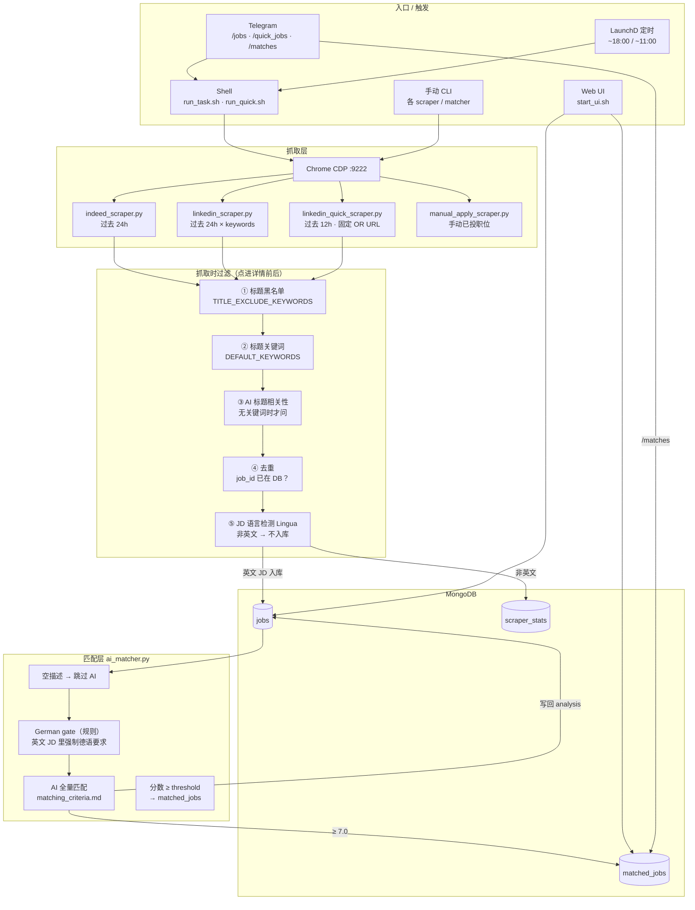
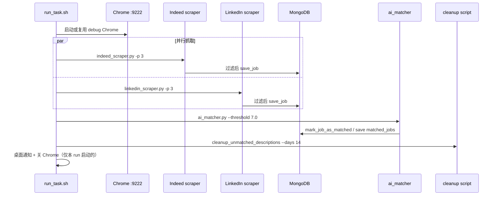
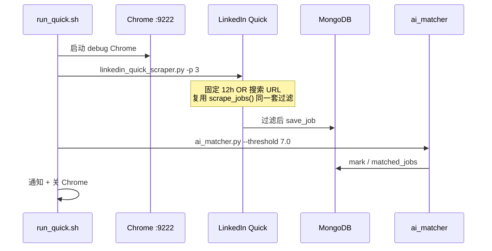
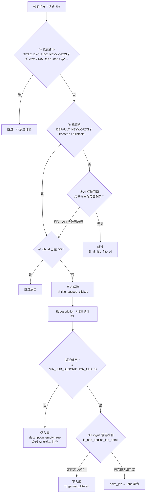
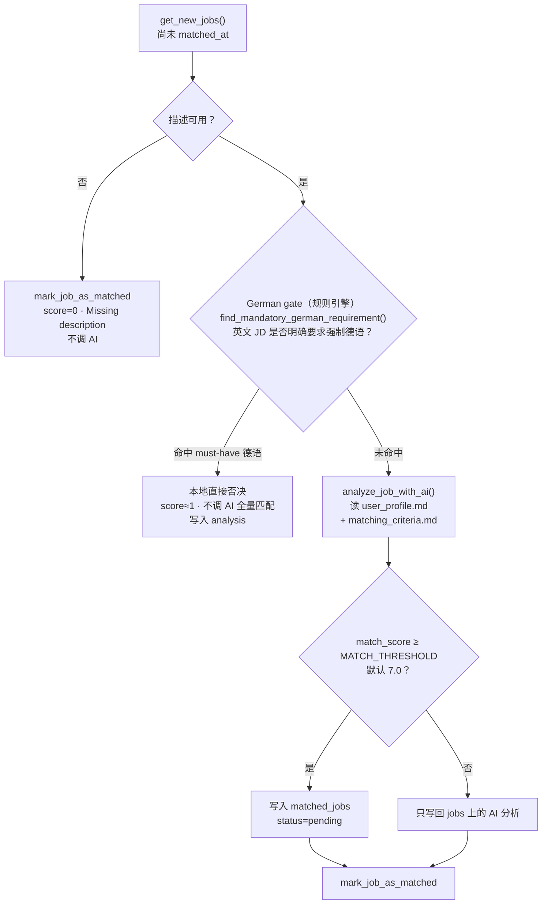

# Job Scraper 架构与流程

本文梳理当前项目的整体架构、入口命令，以及「抓取 → 过滤 → AI 匹配」的完整链路。

---

## 1. 系统鸟瞰



---

## 2. 一共有哪些命令 / 入口

### 2.1 日常主流程（两条 Pipeline）

| 命令 | 何时用 | 做什么 | 大约耗时 |
|------|--------|--------|----------|
| `./run_task.sh` | 晚上 ~18:00（或 Telegram `/jobs`） | Indeed + LinkedIn 并行抓取（24h）→ AI 匹配 → 清理旧 unmatched 描述 | 40–60 min |
| `./run_quick.sh` | 早上 ~11:00（或 Telegram `/quick_jobs`） | 仅 LinkedIn Quick（12h）→ AI 匹配 | 10–20 min |
| `./start_ui.sh` | 随时 | 启动 Job Tracker Web UI（默认 `:5050`） | — |

推荐手动跑时加 `caffeinate -i`，避免 Mac 休眠中断：

```bash
caffeinate -i ./run_task.sh
caffeinate -i ./run_quick.sh
```

### 2.2 Telegram Bot 命令

| 命令 | 作用 |
|------|------|
| `/start` | 确认 bot 在线 |
| `/test` | 确认 Mac 已连上、可跑任务 |
| `/jobs` | 后台跑 `run_task.sh`，结束后推送今日匹配卡片 |
| `/quick_jobs` | 后台跑 `run_quick.sh` |
| `/matches` | 不抓取，只推送今日 `matched_jobs` |

Bot 启动：`python3 src/bot/telegram_bot.py`

### 2.3 单独 CLI（调试 / 补跑）

| 命令 | 作用 |
|------|------|
| `python3 src/scrapers/indeed_scraper.py [-k …] [-p N]` | 只跑 Indeed |
| `python3 src/scrapers/linkedin_scraper.py [-k …] [-p N]` | 只跑 LinkedIn 全量（按 keyword 循环） |
| `python3 src/scrapers/linkedin_quick_scraper.py [-p N] [-j N]` | 只跑 LinkedIn 12h Quick |
| `python3 src/matching/ai_matcher.py [-l N] [-s source] [-t 7.0]` | 只跑 AI 匹配（处理尚未 `matched_at` 的 jobs） |
| `python3 src/scrapers/manual_apply_scraper.py <urls…>` | 手动已投职位：抓详情 + AI 打分 → 直接写入 `matched_jobs`（status=`applied`） |
| `python3 scripts/cleanup_unmatched_descriptions.py …` | 清理旧 unmatched JD 文本（full pipeline 末尾会自动跑） |
| `python3 scripts/cleanup_excluded_titles.py …` | 按标题黑名单清理库里已有数据 |
| `python3 scripts/eval_matcher.py …` | 匹配器评测 |

---

## 3. 两条 Pipeline 的步骤对比

### 3.1 Full：`run_task.sh` / `/jobs`



顺序要点：

1. Chrome remote debugging（已有 `:9222` 则复用）
2. **Indeed + LinkedIn 并行**（各最多 3 页 × keywords）
3. 两边都结束后 → **AI matcher**
4. 清理 14 天前 unmatched 的 description 文本
5. 通知 +（可选）关 Chrome

### 3.2 Quick：`run_quick.sh` / `/quick_jobs`



与 Full 的差异：

- **只有 LinkedIn**，没有 Indeed
- 不按 keyword 循环，而是一条预编码的 OR 搜索 URL（Full Stack / Frontend / Product / GenAI，`f_TPR=r43200` = 12h）
- **不跑** description cleanup
- 卡片处理逻辑与全量 LinkedIn **共用** `linkedin_scraper.scrape_jobs()`（标题过滤、语言检测相同）

---

## 4. 单条职位：从列表卡片到入库的过滤漏斗

这是你最容易「写多了脑子乱」的地方。抓取阶段对**每一张卡片**按下面顺序走：



### 各层分别干什么

| 步骤 | 实现 | 目的 |
|------|------|------|
| ① 标题黑名单 | `is_title_excluded()` · `TITLE_EXCLUDE_KEYWORDS` | 明显不对口的角色直接跳过，省点击 |
| ② 关键词命中 | `title_matches_default_keywords()` · `DEFAULT_KEYWORDS` | 标题已含目标词 → 直接点，不问 AI |
| ③ AI 标题筛 | `is_title_relevant_by_ai()` | 黑名单过了、又没有关键词时，用便宜的一次 AI 判断「像不像目标岗」 |
| ④ 去重 | `is_job_id_exists()` | 已抓过的不重复点开 |
| ⑤ JD 语言 | `is_non_english_job_detail()` · Lingua | **整篇 JD 不是英文**（多数是德语帖）→ **不入库**。UI 里记为 German Filtered |

> 注意：⑤ 是「JD 主体语言是不是英文」，不是「英文 JD 里有没有要求会德语」。后者在匹配阶段用 German gate 处理。

标题三道闸的代码入口统一在：

`should_skip_title_before_click()` → `src/core/scraper_utils.py`

---

## 5. 入库之后：AI 匹配前 / 匹配中

`ai_matcher.py` 只处理 `jobs` 里还没有 `matched_at` 的记录：



### 两道「德语相关」不要搞混

| | 抓取阶段 · 语言检测 | 匹配阶段 · German gate |
|--|---------------------|------------------------|
| **文件** | `scraper_utils.is_non_english_job_detail` | `matching/german_gate.py` |
| **看什么** | JD **写的是哪国语言**（Lingua） | **英文 JD 里**是否写了「必须会德语」 |
| **典型触发** | 整篇德语岗位描述 | “German fluent required”, “C1 Deutsch”, “must speak German” |
| **不触发** | — | 仅 “Berlin, Germany”、German company、German as nice-to-have |
| **结果** | **不入库**，计 `german_filtered` | **入库后否决**，score 很低，**不进入完整 AI 评分**（硬闸） |
| **谁先谁后** | 更早（抓详情时） | 更晚（matcher 开头） |

AI prompt（`matching_criteria.md`）里还有一道逻辑上的 German gate，作为兜底；但代码里会先走规则版 `german_gate`，命中就根本不调模型。

### AI 匹配本身按 criteria 的顺序

1. Hard gates：德语强制要求 → 不熟悉的 sole backend → 年限过高 → DevOps/SRE 核心岗  
2. 普通打分 4–8（required skills + nice-to-have / domain bonus）  
3. Special Match A/B/C → 直接 9–10（Leipzig 可再 +0.5～1）  
4. `match_score ≥ threshold` 才进 `matched_jobs`

详情见 [`matching_criteria.md`](./matching_criteria.md)。

---

## 6. 数据落点

| 集合 | 谁写入 | 内容 |
|------|--------|------|
| `jobs` | scrapers；matcher 回写 analysis | 所有过了语言关的职位（含空描述占位） |
| `matched_jobs` | matcher（≥ threshold）；manual_apply | 高分匹配 / 手动已投 |
| `scraper_stats` | scrapers 计数 | `title_passed_clicked`、`german_filtered`、`ai_title_filtered` 等 |

Web UI（`web_app.py`）读这些集合，展示今日 funnel、匹配列表、未匹配原因等。

---

## 7. 目录与职责速查

```
job_scraper/
├── run_task.sh / run_quick.sh / start_ui.sh   # 主入口脚本
├── docs/
│   ├── architecture.md          # 本文
│   ├── matching_criteria.md     # AI 打分规则（唯一真相源）
│   └── user_profile.md          # 简历 / 画像
├── src/
│   ├── core/
│   │   ├── config.py            # keywords、标题黑名单、平台 URL
│   │   ├── db_mongo.py          # Mongo 读写
│   │   └── scraper_utils.py     # 标题闸、Lingua 语言检测、CDP 工具
│   ├── scrapers/                # Indeed / LinkedIn / Quick / Manual
│   ├── matching/
│   │   ├── ai_matcher.py        # 匹配主流程
│   │   └── german_gate.py       # 英文 JD 强制德语规则闸
│   ├── web/web_app.py           # Tracker UI
│   └── bot/telegram_bot.py      # Telegram 命令
└── scripts/                     # 清理 / 评测辅助
```

---

## 8. 一句话记住整条链

> **列表标题先挡一轮（黑名单 → 关键词 → AI 标题）→ 点开详情 → 非英文 JD 直接扔掉 → 英文 JD 入库 → Matcher 先查「要不要强制德语」→ 再丢给 AI 按 criteria 打分 → ≥ 7 进 Tracker。**

两条日常命令只是换「从哪抓、抓多久」：晚上全量 24h（Indeed+LinkedIn），早上 Quick 12h（仅 LinkedIn）；**过滤与匹配规则两边相同**。
